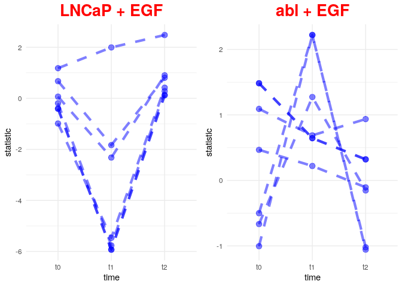

Prostate phosphoSWATH: Enrichment CARNIPHAL Results
================
Alberto Valdeolivas: <alberto.valdeolivas@bioquant.uni-heidelberg.de>;
Date:
18/02/2020

## Abstract

Study the phospho-proteome of two prostate cancer cell lines upon
perturbation with a combination of different ligands and inhibitors.
This vignette is focused on generating cluster of phosphosites following
a given trend in our data.

## Reading and Formatting linear model results

We first loaded the required libraries for the forthcoming analysis.

``` r
library(OmnipathR)
library(dplyr)
library(readr)
library(igraph)
library(bc3net)
library(ggplot2)
library(gridExtra)
```

Then, we read and format the results of our linear model.

``` r
ResultsLinearModel <- read_tsv("Data/limma_model_results_20190301.tsv")

LinearModelData_df <- ResultsLinearModel %>% 
    dplyr::filter(!is.na(residues_str)) %>% 
    dplyr::mutate(residues_str = strsplit(residues_str, "_")) %>% 
    tidyr::unnest(residues_str) %>% 
    dplyr::mutate(GeneSymbol_Residue = paste(GeneSymbol, residues_str, sep="_")) 

covariate_vars <- c("Intercept","ms_day180409", "ms_day180410", "ms_day180412", 
                    "ms_day180414", "Culture_batch", "fraction_missing", "LNCaP")

## From linear model to Matrix suitable to run Viper.
LinearModelData_df_Clean <-     
    LinearModelData_df %>% 
    dplyr::select(statistic,GeneSymbol_Residue, term, p.value) %>%
    dplyr::filter(!(term %in% covariate_vars)) %>%
    dplyr::filter(GeneSymbol_Residue != "NA_SNA") %>%
    dplyr::filter(GeneSymbol_Residue != "NA_TNA") %>%
    dplyr::group_by(GeneSymbol_Residue, term) %>%
    dplyr::filter(p.value == min(p.value)) %>%
    dplyr::ungroup() %>%
    dplyr::distinct() %>% 
    dplyr::select(-p.value)  
```

We focus on the 500 most variable phosphosites to avoid finding cluster
of sites that do not vary under these experimental conditions.

``` r
MostVariableSites <- LinearModelData_df_Clean %>% 
    dplyr::group_by(GeneSymbol_Residue) %>%
    dplyr::mutate(variance = var(statistic))  %>%
    dplyr::arrange(desc(variance)) %>%
    dplyr::distinct(GeneSymbol_Residue, .keep_all = TRUE) %>%
    dplyr::ungroup() %>%
    dplyr::top_n(500) %>%
    dplyr::select(GeneSymbol_Residue)
```

## Computing correlations and Finding Communities of phosphosites

We generate a matrix with all the phosphosites and the conditions and we
compute Pearson correlation on it. Then, we create a network of
phosphosites by drawing an edge between a pair of phosphosites if they
have a correlation larger than 0.7. This is an initial selection that
can be improved or modified. We also create an anticorrelation graph,
although we will now move on with the positive correlation graph.

``` r
MatrixStatistic <- 
    dplyr::semi_join(LinearModelData_df_Clean,MostVariableSites) %>%
    tidyr::pivot_wider(names_from = term, values_from = statistic)  %>%
    tibble::column_to_rownames(var = "GeneSymbol_Residue") %>% 
    as.matrix()

corMatrix <- 
    cor(t(MatrixStatistic), use = "pairwise.complete.obs",method = c("pearson"))

corGraph_AdjMatrix <- 
    apply(corMatrix, 2, function(x){ ifelse(x >= 0.7,1,0)})
AnticorGraph_AdjMatrix <- 
    apply(corMatrix, 2, function(x){ ifelse(x <= -0.7,1,0)})    
```

Then, we apply Louvain clustering on the graph. It is to note that we
apply an iterative version of Louvain. The method is applied in a
recursive way for those communities larger than a given size. We chose
communities containing between 5 and 40 phosphosites. This election is
arbitrary but based on the fact that a cluster of this number of
phosphosites is easier to interpret from a biological perspective (check
how many phosphosites are in avergare regulated by a kinase).

``` r
## Transform to an igraph object
corGraph_igraph <- graph_from_adjacency_matrix(corGraph_AdjMatrix, 
    mode = c("undirected"), diag = FALSE)

## I get the largest connected component of the graph: 
corGraph_igraph <- getgcc(corGraph_igraph)

## Function to Perform an iterative Louvain Clustering.
IterativeLouvain <- function(x,OriginalNetwork,minSize,maxSize) {
  a <- 0 
  n <- length(x)
  newList <- list()
  for (i in seq(n)){
    currentGenes <- x[[i]]
    if (length(currentGenes) >= minSize){
      if(length(currentGenes) <= maxSize){
        a <- a + 1 
        newList[a]  <-x[i]
      } else {
        Subnetwork <-induced_subgraph(OriginalNetwork, currentGenes)
        Modules_rec <- cluster_louvain(Subnetwork, weights = E(Subnetwork)$weight)  
        m <- length(Modules_rec)
        for (j in seq(m)){
          if (length(Modules_rec[[j]]) >= minSize ){
            a <- a + 1 
            newList[[a]] <- Modules_rec[[j]]
          }
        }  
      } 
    }
  }
  return(newList)
}

## We define the size of the modules and the maximun number of iterations. 
smallest_size <- 5
largest_size <- 40
iter <- 0

## First Louvain clustering to obtain the first modules
Modules <- cluster_louvain(corGraph_igraph)

## Iterative clusters to split the first modules into smaller clusters.
while (max(sapply(Modules[],length)) >= largest_size && iter <= 100) {
  iter <-iter +1 
  # print (iter)
  NewModules <- IterativeLouvain(Modules,corGraph_igraph,smallest_size,largest_size)
  Modules <- NewModules  
}
```

## Plotting the Results

In this case, we focus on analysing the trend of phospohsites in the
different time points between the two cell lines when no inhibition is
applied and the EGF ligand is present.

We first select the experimental conditions of interest and the
phosphosites of a given module and extract their t-values from our
linear model.

``` r
## I select my conditions of interest
ConditionA <- 
    c("LNCaP_noInhib_t0_noLigand", "LNCaP_noInhib_t1_EGF","LNCaP_noInhib_t2_EGF")
ConditionB <- 
    c("abl_noInhib_t0_noLigand", "abl_noInhib_t1_EGF","abl_noInhib_t2_EGF")

## I take as an one of our modules:
SitesModule <- Modules[[21]]
SitesModule
```

    ## [1] "HTATSF1_S721" "HNRNPC_S233"  "SRRM1_T572"   "SRRM1_T574"   "HTATSF1_S714"
    ## [6] "IL12RB2_S748" "ILF3_S482"

``` r
## We extract the info for these conditions
LinearModelData_df_SelectA <- LinearModelData_df_Clean %>%
    dplyr::filter(term %in% ConditionA, GeneSymbol_Residue %in% SitesModule) %>%
    dplyr::mutate(time = ifelse(grepl("_t0_", term), "t0", 
                         ifelse(grepl("_t1_", term), "t1","t2")))

LinearModelData_df_SelectB <- LinearModelData_df_Clean %>%
    dplyr::filter(term %in% ConditionB, GeneSymbol_Residue %in% SitesModule) %>%
    dplyr::mutate(time = ifelse(grepl("_t0_", term), "t0", 
                         ifelse(grepl("_t1_", term), "t1","t2")))
```

We finally plot the results.

``` r
pA <- ggplot(data=LinearModelData_df_SelectA, aes(x=time, y=statistic, group=GeneSymbol_Residue)) +
    geom_line(alpha = 0.5, color = "blue", linetype = "dashed", size= 1.5) +
    geom_point(alpha = 0.5, size = 3,  color = "blue") +  
    theme_minimal() + ggtitle("LNCaP + EGF") + 
    theme(plot.title = element_text(size = 20, face = "bold", colour = "red", 
                                    hjust = 0.5))


pB <- ggplot(data=LinearModelData_df_SelectB, aes(x=time, y=statistic, group=GeneSymbol_Residue)) +
    geom_line(alpha = 0.5, color = "blue", linetype = "dashed", size= 1.5) +
    geom_point(alpha = 0.5, size = 3,  color = "blue") +  
    theme_minimal() + ggtitle("abl + EGF")   + 
    theme(plot.title = element_text(size = 20, face = "bold", colour = "red",
                                    hjust = 0.5))

grid.arrange(pA, pB, ncol=2)
```

<!-- -->

## Conclusions

This is just an illustration of what we aim at finding clustering the
phosphosites. However,it is to note that the procedure described in this
vignette is not the most optimal. We computed the correlations taking
into account all the experimental conditions and later we only focused
on a given one. Therefore, some phosphosites in the cluster of the
analysed condition can have an unexpected behaviour. We can define a
better procedure based on what we want to analyse. I think that it would
be very interesting to find clusters of phosphosites that have a similar
behaviour/trend in one condition and the opposite in another.

## R session Info

``` r
sessionInfo()
```

    ## R version 3.6.2 (2019-12-12)
    ## Platform: x86_64-pc-linux-gnu (64-bit)
    ## Running under: Ubuntu 18.04.4 LTS
    ## 
    ## Matrix products: default
    ## BLAS:   /usr/lib/x86_64-linux-gnu/openblas/libblas.so.3
    ## LAPACK: /usr/lib/x86_64-linux-gnu/libopenblasp-r0.2.20.so
    ## 
    ## locale:
    ##  [1] LC_CTYPE=en_GB.UTF-8       LC_NUMERIC=C              
    ##  [3] LC_TIME=en_GB.UTF-8        LC_COLLATE=en_GB.UTF-8    
    ##  [5] LC_MONETARY=en_GB.UTF-8    LC_MESSAGES=en_GB.UTF-8   
    ##  [7] LC_PAPER=en_GB.UTF-8       LC_NAME=C                 
    ##  [9] LC_ADDRESS=C               LC_TELEPHONE=C            
    ## [11] LC_MEASUREMENT=en_GB.UTF-8 LC_IDENTIFICATION=C       
    ## 
    ## attached base packages:
    ## [1] stats     graphics  grDevices utils     datasets  methods   base     
    ## 
    ## other attached packages:
    ##  [1] gridExtra_2.3   ggplot2_3.2.1   bc3net_1.0.4    lattice_0.20-38
    ##  [5] Matrix_1.2-18   infotheo_1.2.0  c3net_1.1.1     readr_1.3.1    
    ##  [9] dplyr_0.8.3     OmnipathR_1.1.2 igraph_1.2.4.2 
    ## 
    ## loaded via a namespace (and not attached):
    ##  [1] Rcpp_1.0.3       pillar_1.4.2     compiler_3.6.2   tools_3.6.2     
    ##  [5] zeallot_0.1.0    digest_0.6.23    evaluate_0.14    tibble_2.1.3    
    ##  [9] lifecycle_0.1.0  gtable_0.3.0     pkgconfig_2.0.3  rlang_0.4.2     
    ## [13] yaml_2.2.0       xfun_0.11        withr_2.1.2      stringr_1.4.0   
    ## [17] knitr_1.26       vctrs_0.2.1      hms_0.5.2        grid_3.6.2      
    ## [21] tidyselect_0.2.5 glue_1.3.1       R6_2.4.1         rmarkdown_2.0   
    ## [25] farver_2.0.1     tidyr_1.0.0      purrr_0.3.3      magrittr_1.5    
    ## [29] backports_1.1.5  scales_1.1.0     htmltools_0.4.0  assertthat_0.2.1
    ## [33] colorspace_1.4-1 labeling_0.3     stringi_1.4.3    lazyeval_0.2.2  
    ## [37] munsell_0.5.0    crayon_1.3.4
