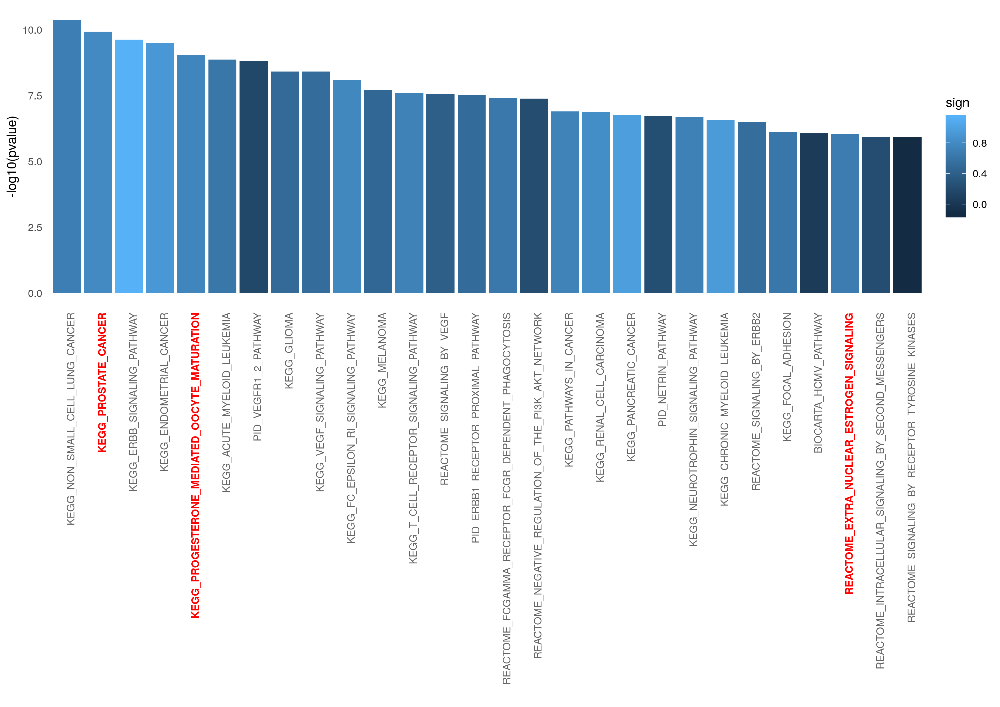

```{r setup, include=FALSE}
knitr::opts_chunk$set(echo = TRUE)
```

## Abstract

Study the phospho-proteome of two prostate cancer cell lines upon perturbation 
with a combination of different ligands and inhibitors. This vignette is focused
on the analyses of the CARNIPHAL results by running an enrichment analysis 
and plotting the results. See Vignette: 

<https://github.com/saezlab/prostate-phosphoSWATH_V2/blob/master/RunCARNIPHAL.md>


## Reading input data for Enrichment Analysis

To perform the enrichment analysis, we need to read the following input files:

+ Output from CARNIPHAL: to obtain the significant genes and the background 
genes

+ Datasets from MSigDB: describing the pathways in which our significant genes
are known to be involved in. 

+ Kinase Activity Estimation results: to evaluate the activity of the enzymes
involved in the different enriched pathaways.


We first load the required packages 

```{r, message=FALSE}
library(readr)
library(piano)
library(dplyr)
library(omicToolsTest)
library(ggplot2)
```


### Reading and formatting CARNIPHAL output

We read the CARNIPHAL results generated in the aforementioned script. We define
two different gene sets in order tor conduct the enrichment. The first set 
contains the nodes that appear in the CARNIPHAL output and are therefore 
relevant in the context of our input phosphoproteomic data. The second set 
contains all the genes in our prior knowledge network which are used as the
backgroud. 

```{r, message=FALSE}
CarnivalResults <- readRDS("Results/CarnivalResults.rds")

CarnivalNetwork <- as.data.frame(CarnivalResults$weightedSIF, stringsAsFactors = FALSE)
    
colnames(CarnivalNetwork) <- c("source", "sign", "target", "Weight")

## We define the set of nodes interesting for our condition
sucesses <- unique(c(gsub("_.*","",CarnivalNetwork$source), 
    gsub("_.*","",CarnivalNetwork$target)))


CarnivalAttributes <- as.data.frame(CarnivalResults$nodesAttributes, 
    stringsAsFactors = FALSE)

## We define the background as all the genes in our prior knowledge network.
bg <- unique(gsub("_.*","",CarnivalAttributes$Node))        
```

### Reading and formatting Kinase Activity output

We read and format the Kinase activity output generated in our script:

<https://github.com/saezlab/prostate-phosphoSWATH_V2/blob/master/KinaseActivityAnalyses.md>

This activity will be mapped to the genes invovled in the most significant 
pathways.

```{r, message=FALSE}
Kin_activity_PDTs <- 
    as.data.frame(readRDS("Results/Kin_activity_PDTs.rds")) 

Condition_UnderStudy <- "LNCaP_noInhib_t1_EGF"

Kin_activity_condition <- Kin_activity_PDTs  %>%
    dplyr::select(Condition_UnderStudy) 

kinases <- as.data.frame(Kin_activity_condition)
```

### Reading Pathway data sets from MSigDB

We downloaded from MSigDB <https://www.gsea-msigdb.org/> the following dataset:
c2.cp.v7.0.symbols.gmt. It contains several pathways from different resources
and the genes that are known to be involved in those pathways. 

```{r, message=FALSE}
pathways <- gmt_to_csv("Data/c2.cp.v7.0.symbols.gmt")
```

## Performing Enrichment Analysis and plotting the Results

Using the **Piano** R package, we run a gene set analysis (GSA) based on a list 
of significant genes (CARNIPHAL nodes) and a gene set collection (background). 
It uses Fisher's exact test. Then, we map kinase activity into the genes of 
the resulting significant pathways.

```{r, message=FALSE, warning=FALSE}
## We run GSA hyper Geometric test
sig_pathways <- runGSAhyper(sucesses, universe = bg, gsc = loadGSC(pathways))
sig_pathways_df <- as.data.frame(sig_pathways$resTab)

## We map the kinase activity into the resulting enriched pathways
sig_pathways_df$sign <- 
    unlist(lapply(row.names(sig_pathways_df), function(x, kinases, pathways){
  return(mean(kinases[row.names(kinases) %in% pathways[pathways$term == x,1],1]))
},kinases = kinases, pathways = pathways))

sig_pathways_df <- sig_pathways_df[!is.nan(sig_pathways_df$sign),]
```

We format the results and we prepare them to be plotted. For visualization 
purposes, we just select pathways with adjusted p-values lower than 0.0001.

```{r, message=FALSE}
PathwaysSelect <- sig_pathways_df[,c(1,2,7)]
PathwaysSign <- PathwaysSelect[PathwaysSelect$`Adjusted p-value` <= 0.0001,]
PathwaysSign$pathway <- row.names(PathwaysSign) 
PathwaysSign <- PathwaysSign[,c(4,1,2,3)]
colnames(PathwaysSign) <- c("pathway","pvalue","AdjPvalu","sign")
PathwaysSign$pathway <- as.factor(PathwaysSign$pathway )

PathwaysSelect <- sig_pathways_df %>%
    tibble::rownames_to_column(var = "pathway") %>%
    dplyr::select(pathway, `p-value`, `Adjusted p-value`, sign) %>%
    dplyr::filter(`Adjusted p-value` <= 0.0001)  
   
colnames(PathwaysSelect) <- c("pathway","pvalue","AdjPvalu","sign")
PathwaysSelect$pathway <- as.factor(PathwaysSelect$pathway )
```

We finally plot the results highlighting the most relevant pathways.

```{r, message=FALSE}
Interesting_pathways <- c("KEGG_PROGESTERONE_MEDIATED_OOCYTE_MATURATION",
                          "KEGG_PROSTATE_CANCER",
                          "REACTOME_EXTRA_NUCLEAR_ESTROGEN_SIGNALING")

p <- ggplot(PathwaysSign, aes(x = reorder(pathway, pvalue), y = -log10(pvalue) , fill=sign)) + 
    geom_col() +
    theme_minimal() +
    theme(axis.text.x = element_text(angle = 90, hjust = 1, 
        colour = ifelse(levels(reorder(PathwaysSign$pathway, PathwaysSign$pvalue)) %in% 
            Interesting_pathways, "red", "grey40"),
        face = ifelse(levels(reorder(PathwaysSign$pathway, PathwaysSign$pvalue)) %in% 
            Interesting_pathways, "bold", "plain")),
    panel.grid.major = element_blank(), 
    panel.grid.minor = element_blank()) + 
    xlab("")
ggsave("Results/EnrichmentBarPlot_LNCaP.png", plot = p, height = 8.27,
    width = 11.69 , units = c("in")) 
ggsave("Results/EnrichmentBarPlot_LNCaP.pdf", plot = p, height = 8.27,
    width = 11.69 , units = c("in")) 
```

<br><br>

<br><br>

For a better visualization of these figures, one can find the original files 
here: 

<https://github.com/saezlab/prostate-phosphoSWATH_V2/blob/master/Results/EnrichmentBarPlot_LNCaP.pdf>

<https://github.com/saezlab/prostate-phosphoSWATH_V2/blob/master/Results/EnrichmentBarPlot_LNCaP.png>


## Conclusions

It is very encouraging for us to retrieve *Prostate Cancer* as the second most 
enriched pathway. The approach followed was mainly data-driven and it shows 
the ability of our data to capture already known knowledge about prostate 
cancer. We therefore believe that the large amount of phosphosites detected in
our study and not reported in dedicated databases are a valuable source of 
biological knowledge to further understand prostate cancer. 

It also looks very appealing to get the *Progesterone Mediated Oocyte Maturation* 
pathway as one of the top enriched. Some members of the steroid hormone family, 
such as progesterone, are also implicated in prostate cancer, but progesterone’s 
role remains undefined. A high PGRB expression in tumor tissue is associated
with an unfavorable prognosis (Extracted from Grindstad et al. 2018). 

Moreover, we also retrieved an enrichment in the *Extra Nuclear Estrogen Signaling* 
pathway. Check *Estrogen action and prostate cancer* (Nelles et al. 2011). 

## References

Grindstad T, Richardsen E, Andersen S, et al. Progesterone Receptors in Prostate Cancer: Progesterone receptor B is the isoform associated with disease progression. Sci Rep. 2018;8(1):11358. Published 2018 Jul 27. doi:10.1038/s41598-018-29520-5

Nelles, Jason L et al. “Estrogen action and prostate cancer.” Expert review of endocrinology & metabolism vol. 6,3 (2011): 437-451. doi:10.1586/eem.11.20


## R session Info

```{r}
sessionInfo()
```

