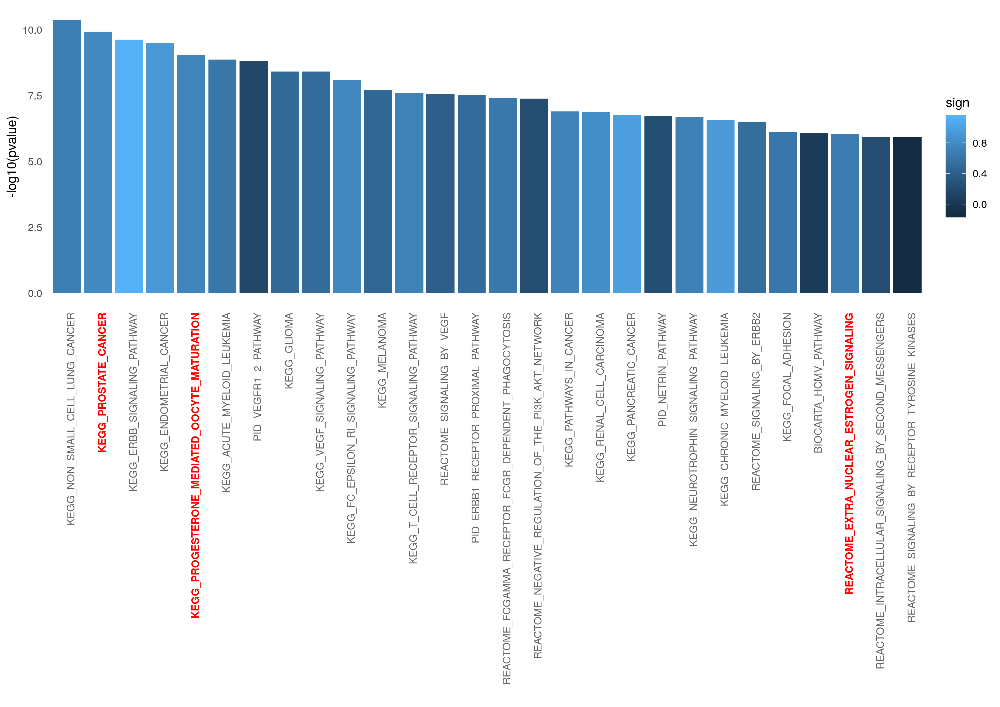

Prostate phosphoSWATH: Enrichment CARNIPHAL Results
================
Alberto Valdeolivas: <alberto.valdeolivas@bioquant.uni-heidelberg.de>;
Date:
17/02/2020

## Abstract

Study the phospho-proteome of two prostate cancer cell lines upon
perturbation with a combination of different ligands and inhibitors.
This vignette is focused on the analyses of the CARNIPHAL results by
running an enrichment analysis and plotting the results. See Vignette:

<https://github.com/saezlab/prostate-phosphoSWATH_V2/blob/master/RunCARNIPHAL.md>

## Reading input data for Enrichment Analysis

To perform the enrichment analysis, we need to read the following input
files:

  - Output from CARNIPHAL: to obtain the significant genes and the
    background genes

  - Datasets from MSigDB: describing the pathways in which our
    significant genes are known to be involved in.

  - Kinase Activity Estimation results: to evaluate the activity of the
    enzymes involved in the different enriched pathaways.

We first load the required packages

``` r
library(readr)
library(piano)
library(dplyr)
library(omicToolsTest)
```

    ## Warning: replacing previous import 'reshape::stamp' by 'cowplot::stamp' when
    ## loading 'omicToolsTest'

    ## Warning: replacing previous import 'igraph::union' by 'GSEABase::union' when
    ## loading 'omicToolsTest'

``` r
library(ggplot2)
```

### Reading and formatting CARNIPHAL output

We read the CARNIPHAL results generated in the aforementioned script. We
define two different gene sets in order tor conduct the enrichment. The
first set contains the nodes that appear in the CARNIPHAL output and are
therefore relevant in the context of our input phosphoproteomic data.
The second set contains all the genes in our prior knowledge network
which are used as the backgroud.

``` r
CarnivalResults <- readRDS("Results/CarnivalResults.rds")

CarnivalNetwork <- as.data.frame(CarnivalResults$weightedSIF, stringsAsFactors = FALSE)
    
colnames(CarnivalNetwork) <- c("source", "sign", "target", "Weight")

## We define the set of nodes interesting for our condition
sucesses <- unique(c(gsub("_.*","",CarnivalNetwork$source), 
    gsub("_.*","",CarnivalNetwork$target)))


CarnivalAttributes <- as.data.frame(CarnivalResults$nodesAttributes, 
    stringsAsFactors = FALSE)

## We define the background as all the genes in our prior knowledge network.
bg <- unique(gsub("_.*","",CarnivalAttributes$Node))        
```

### Reading and formatting Kinase Activity output

We read and format the Kinase activity output generated in our script:

<https://github.com/saezlab/prostate-phosphoSWATH_V2/blob/master/KinaseActivityAnalyses.md>

This activity will be mapped to the genes invovled in the most
significant pathways.

``` r
Kin_activity_PDTs <- 
    as.data.frame(readRDS("Results/Kin_activity_PDTs.rds")) 

Condition_UnderStudy <- "LNCaP_noInhib_t1_EGF"

Kin_activity_condition <- Kin_activity_PDTs  %>%
    dplyr::select(Condition_UnderStudy) 

kinases <- as.data.frame(Kin_activity_condition)
```

### Reading Pathway data sets from MSigDB

We downloaded from MSigDB <https://www.gsea-msigdb.org/> the following
dataset: c2.cp.v7.0.symbols.gmt. It contains several pathways from
different resources and the genes that are known to be involved in those
pathways.

``` r
pathways <- gmt_to_csv("Data/c2.cp.v7.0.symbols.gmt")
```

    ##   |                                                                              |                                                                      |   0%  |                                                                              |                                                                      |   1%  |                                                                              |=                                                                     |   1%  |                                                                              |=                                                                     |   2%  |                                                                              |==                                                                    |   2%  |                                                                              |==                                                                    |   3%  |                                                                              |==                                                                    |   4%  |                                                                              |===                                                                   |   4%  |                                                                              |===                                                                   |   5%  |                                                                              |====                                                                  |   5%  |                                                                              |====                                                                  |   6%  |                                                                              |=====                                                                 |   6%  |                                                                              |=====                                                                 |   7%  |                                                                              |=====                                                                 |   8%  |                                                                              |======                                                                |   8%  |                                                                              |======                                                                |   9%  |                                                                              |=======                                                               |   9%  |                                                                              |=======                                                               |  10%  |                                                                              |=======                                                               |  11%  |                                                                              |========                                                              |  11%  |                                                                              |========                                                              |  12%  |                                                                              |=========                                                             |  12%  |                                                                              |=========                                                             |  13%  |                                                                              |=========                                                             |  14%  |                                                                              |==========                                                            |  14%  |                                                                              |==========                                                            |  15%  |                                                                              |===========                                                           |  15%  |                                                                              |===========                                                           |  16%  |                                                                              |============                                                          |  16%  |                                                                              |============                                                          |  17%  |                                                                              |============                                                          |  18%  |                                                                              |=============                                                         |  18%  |                                                                              |=============                                                         |  19%  |                                                                              |==============                                                        |  19%  |                                                                              |==============                                                        |  20%  |                                                                              |==============                                                        |  21%  |                                                                              |===============                                                       |  21%  |                                                                              |===============                                                       |  22%  |                                                                              |================                                                      |  22%  |                                                                              |================                                                      |  23%  |                                                                              |================                                                      |  24%  |                                                                              |=================                                                     |  24%  |                                                                              |=================                                                     |  25%  |                                                                              |==================                                                    |  25%  |                                                                              |==================                                                    |  26%  |                                                                              |===================                                                   |  26%  |                                                                              |===================                                                   |  27%  |                                                                              |===================                                                   |  28%  |                                                                              |====================                                                  |  28%  |                                                                              |====================                                                  |  29%  |                                                                              |=====================                                                 |  29%  |                                                                              |=====================                                                 |  30%  |                                                                              |=====================                                                 |  31%  |                                                                              |======================                                                |  31%  |                                                                              |======================                                                |  32%  |                                                                              |=======================                                               |  32%  |                                                                              |=======================                                               |  33%  |                                                                              |=======================                                               |  34%  |                                                                              |========================                                              |  34%  |                                                                              |========================                                              |  35%  |                                                                              |=========================                                             |  35%  |                                                                              |=========================                                             |  36%  |                                                                              |==========================                                            |  36%  |                                                                              |==========================                                            |  37%  |                                                                              |==========================                                            |  38%  |                                                                              |===========================                                           |  38%  |                                                                              |===========================                                           |  39%  |                                                                              |============================                                          |  39%  |                                                                              |============================                                          |  40%  |                                                                              |============================                                          |  41%  |                                                                              |=============================                                         |  41%  |                                                                              |=============================                                         |  42%  |                                                                              |==============================                                        |  42%  |                                                                              |==============================                                        |  43%  |                                                                              |==============================                                        |  44%  |                                                                              |===============================                                       |  44%  |                                                                              |===============================                                       |  45%  |                                                                              |================================                                      |  45%  |                                                                              |================================                                      |  46%  |                                                                              |=================================                                     |  46%  |                                                                              |=================================                                     |  47%  |                                                                              |=================================                                     |  48%  |                                                                              |==================================                                    |  48%  |                                                                              |==================================                                    |  49%  |                                                                              |===================================                                   |  49%  |                                                                              |===================================                                   |  50%  |                                                                              |===================================                                   |  51%  |                                                                              |====================================                                  |  51%  |                                                                              |====================================                                  |  52%  |                                                                              |=====================================                                 |  52%  |                                                                              |=====================================                                 |  53%  |                                                                              |=====================================                                 |  54%  |                                                                              |======================================                                |  54%  |                                                                              |======================================                                |  55%  |                                                                              |=======================================                               |  55%  |                                                                              |=======================================                               |  56%  |                                                                              |========================================                              |  56%  |                                                                              |========================================                              |  57%  |                                                                              |========================================                              |  58%  |                                                                              |=========================================                             |  58%  |                                                                              |=========================================                             |  59%  |                                                                              |==========================================                            |  59%  |                                                                              |==========================================                            |  60%  |                                                                              |==========================================                            |  61%  |                                                                              |===========================================                           |  61%  |                                                                              |===========================================                           |  62%  |                                                                              |============================================                          |  62%  |                                                                              |============================================                          |  63%  |                                                                              |============================================                          |  64%  |                                                                              |=============================================                         |  64%  |                                                                              |=============================================                         |  65%  |                                                                              |==============================================                        |  65%  |                                                                              |==============================================                        |  66%  |                                                                              |===============================================                       |  66%  |                                                                              |===============================================                       |  67%  |                                                                              |===============================================                       |  68%  |                                                                              |================================================                      |  68%  |                                                                              |================================================                      |  69%  |                                                                              |=================================================                     |  69%  |                                                                              |=================================================                     |  70%  |                                                                              |=================================================                     |  71%  |                                                                              |==================================================                    |  71%  |                                                                              |==================================================                    |  72%  |                                                                              |===================================================                   |  72%  |                                                                              |===================================================                   |  73%  |                                                                              |===================================================                   |  74%  |                                                                              |====================================================                  |  74%  |                                                                              |====================================================                  |  75%  |                                                                              |=====================================================                 |  75%  |                                                                              |=====================================================                 |  76%  |                                                                              |======================================================                |  76%  |                                                                              |======================================================                |  77%  |                                                                              |======================================================                |  78%  |                                                                              |=======================================================               |  78%  |                                                                              |=======================================================               |  79%  |                                                                              |========================================================              |  79%  |                                                                              |========================================================              |  80%  |                                                                              |========================================================              |  81%  |                                                                              |=========================================================             |  81%  |                                                                              |=========================================================             |  82%  |                                                                              |==========================================================            |  82%  |                                                                              |==========================================================            |  83%  |                                                                              |==========================================================            |  84%  |                                                                              |===========================================================           |  84%  |                                                                              |===========================================================           |  85%  |                                                                              |============================================================          |  85%  |                                                                              |============================================================          |  86%  |                                                                              |=============================================================         |  86%  |                                                                              |=============================================================         |  87%  |                                                                              |=============================================================         |  88%  |                                                                              |==============================================================        |  88%  |                                                                              |==============================================================        |  89%  |                                                                              |===============================================================       |  89%  |                                                                              |===============================================================       |  90%  |                                                                              |===============================================================       |  91%  |                                                                              |================================================================      |  91%  |                                                                              |================================================================      |  92%  |                                                                              |=================================================================     |  92%  |                                                                              |=================================================================     |  93%  |                                                                              |=================================================================     |  94%  |                                                                              |==================================================================    |  94%  |                                                                              |==================================================================    |  95%  |                                                                              |===================================================================   |  95%  |                                                                              |===================================================================   |  96%  |                                                                              |====================================================================  |  96%  |                                                                              |====================================================================  |  97%  |                                                                              |====================================================================  |  98%  |                                                                              |===================================================================== |  98%  |                                                                              |===================================================================== |  99%  |                                                                              |======================================================================|  99%  |                                                                              |======================================================================| 100%

## Performing Enrichment Analysis and plotting the Results

Using the **Piano** R package, we run a gene set analysis (GSA) based on
a list of significant genes (CARNIPHAL nodes) and a gene set collection
(background). It uses Fisher’s exact test. Then, we map kinase activity
into the genes of the resulting significant pathways.

``` r
## We run GSA hyper Geometric test
sig_pathways <- runGSAhyper(sucesses, universe = bg, gsc = loadGSC(pathways))
sig_pathways_df <- as.data.frame(sig_pathways$resTab)

## We map the kinase activity into the resulting enriched pathways
sig_pathways_df$sign <- 
    unlist(lapply(row.names(sig_pathways_df), function(x, kinases, pathways){
  return(mean(kinases[row.names(kinases) %in% pathways[pathways$term == x,1],1]))
},kinases = kinases, pathways = pathways))

sig_pathways_df <- sig_pathways_df[!is.nan(sig_pathways_df$sign),]
```

We format the results and we prepare them to be plotted. For
visualization purposes, we just select pathways with adjusted p-values
lower than 0.0001.

``` r
PathwaysSelect <- sig_pathways_df[,c(1,2,7)]
PathwaysSign <- PathwaysSelect[PathwaysSelect$`Adjusted p-value` <= 0.0001,]
PathwaysSign$pathway <- row.names(PathwaysSign) 
PathwaysSign <- PathwaysSign[,c(4,1,2,3)]
colnames(PathwaysSign) <- c("pathway","pvalue","AdjPvalu","sign")
PathwaysSign$pathway <- as.factor(PathwaysSign$pathway )

PathwaysSelect <- sig_pathways_df %>%
    tibble::rownames_to_column(var = "pathway") %>%
    dplyr::select(pathway, `p-value`, `Adjusted p-value`, sign) %>%
    dplyr::filter(`Adjusted p-value` <= 0.0001)  
   
colnames(PathwaysSelect) <- c("pathway","pvalue","AdjPvalu","sign")
PathwaysSelect$pathway <- as.factor(PathwaysSelect$pathway )
```

We finally plot the results highlighting the most relevant pathways.

``` r
Interesting_pathways <- c("KEGG_PROGESTERONE_MEDIATED_OOCYTE_MATURATION",
                          "KEGG_PROSTATE_CANCER",
                          "REACTOME_EXTRA_NUCLEAR_ESTROGEN_SIGNALING")

p <- ggplot(PathwaysSign, aes(x = reorder(pathway, pvalue), y = -log10(pvalue) , fill=sign)) + 
    geom_col() +
    theme_minimal() +
    theme(axis.text.x = element_text(angle = 90, hjust = 1, 
        colour = ifelse(levels(reorder(PathwaysSign$pathway, PathwaysSign$pvalue)) %in% 
            Interesting_pathways, "red", "grey40"),
        face = ifelse(levels(reorder(PathwaysSign$pathway, PathwaysSign$pvalue)) %in% 
            Interesting_pathways, "bold", "plain")),
    panel.grid.major = element_blank(), 
    panel.grid.minor = element_blank()) + 
    xlab("")
ggsave("Results/EnrichmentBarPlot_LNCaP.png", plot = p, height = 8.27,
    width = 11.69 , units = c("in")) 
ggsave("Results/EnrichmentBarPlot_LNCaP.pdf", plot = p, height = 8.27,
    width = 11.69 , units = c("in")) 
```

<br><br>  <br><br>

For a better visualization of these figures, one can find the original
files here:

<https://github.com/saezlab/prostate-phosphoSWATH_V2/blob/master/Results/EnrichmentBarPlot_LNCaP.pdf>

<https://github.com/saezlab/prostate-phosphoSWATH_V2/blob/master/Results/EnrichmentBarPlot_LNCaP.png>

## Conclusions

It is very encouraging for us to retrieve *Prostate Cancer* as the
second most enriched pathway. The approach followed was mainly
data-driven and it shows the ability of our data to capture already
known knowledge about prostate cancer. We therefore believe that the
large amount of phosphosites detected in our study and not reported in
dedicated databases are a valuable source of biological knowledge to
further understand prostate cancer.

It also looks very appealing to get the *Progesterone Mediated Oocyte
Maturation* pathway as one of the top enriched. Some members of the
steroid hormone family, such as progesterone, are also implicated in
prostate cancer, but progesterone’s role remains undefined. A high PGRB
expression in tumor tissue is associated with an unfavorable prognosis
(Extracted from Grindstad et al. 2018).

Moreover, we also retrieved an enrichment in the *Extra Nuclear Estrogen
Signaling* pathway. Check *Estrogen action and prostate cancer* (Nelles
et al. 2011).

## References

Grindstad T, Richardsen E, Andersen S, et al. Progesterone Receptors in
Prostate Cancer: Progesterone receptor B is the isoform associated with
disease progression. Sci Rep. 2018;8(1):11358. Published 2018 Jul 27.
<doi:10.1038/s41598-018-29520-5>

Nelles, Jason L et al. “Estrogen action and prostate cancer.” Expert
review of endocrinology & metabolism vol. 6,3 (2011): 437-451.
<doi:10.1586/eem.11.20>

## R session Info

``` r
sessionInfo()
```

    ## R version 3.6.2 (2019-12-12)
    ## Platform: x86_64-pc-linux-gnu (64-bit)
    ## Running under: Ubuntu 18.04.4 LTS
    ## 
    ## Matrix products: default
    ## BLAS:   /usr/lib/x86_64-linux-gnu/openblas/libblas.so.3
    ## LAPACK: /usr/lib/x86_64-linux-gnu/libopenblasp-r0.2.20.so
    ## 
    ## locale:
    ##  [1] LC_CTYPE=en_GB.UTF-8       LC_NUMERIC=C              
    ##  [3] LC_TIME=en_GB.UTF-8        LC_COLLATE=en_GB.UTF-8    
    ##  [5] LC_MONETARY=en_GB.UTF-8    LC_MESSAGES=en_GB.UTF-8   
    ##  [7] LC_PAPER=en_GB.UTF-8       LC_NAME=C                 
    ##  [9] LC_ADDRESS=C               LC_TELEPHONE=C            
    ## [11] LC_MEASUREMENT=en_GB.UTF-8 LC_IDENTIFICATION=C       
    ## 
    ## attached base packages:
    ## [1] stats     graphics  grDevices utils     datasets  methods   base     
    ## 
    ## other attached packages:
    ## [1] ggplot2_3.2.1       omicToolsTest_0.1.0 dplyr_0.8.3        
    ## [4] piano_2.2.0         readr_1.3.1        
    ## 
    ## loaded via a namespace (and not attached):
    ##   [1] bitops_1.0-6         bit64_0.9-7          httr_1.4.1          
    ##   [4] RColorBrewer_1.1-2   tools_3.6.2          backports_1.1.5     
    ##   [7] R6_2.4.1             DT_0.10              KernSmooth_2.23-16  
    ##  [10] DBI_1.1.0            lazyeval_0.2.2       BiocGenerics_0.32.0 
    ##  [13] colorspace_1.4-1     withr_2.1.2          tidyselect_0.2.5    
    ##  [16] gridExtra_2.3        curl_4.3             bit_1.1-14          
    ##  [19] compiler_3.6.2       graph_1.64.0         Biobase_2.46.0      
    ##  [22] shinyjs_1.0          labeling_0.3         slam_0.1-46         
    ##  [25] caTools_1.17.1.3     scales_1.1.0         relations_0.6-9     
    ##  [28] rappdirs_0.3.1       snowfall_1.84-6.1    stringr_1.4.0       
    ##  [31] digest_0.6.23        rmarkdown_2.0        pkgconfig_2.0.3     
    ##  [34] htmltools_0.4.0      dbplyr_1.4.2         fastmap_1.0.1       
    ##  [37] limma_3.42.0         htmlwidgets_1.5.1    rlang_0.4.2         
    ##  [40] RSQLite_2.1.4        shiny_1.4.0          farver_2.0.1        
    ##  [43] visNetwork_2.0.9     jsonlite_1.6         BiocParallel_1.20.0 
    ##  [46] gtools_3.8.1         RCurl_1.95-4.12      magrittr_1.5        
    ##  [49] Matrix_1.2-18        Rcpp_1.0.3           munsell_0.5.0       
    ##  [52] S4Vectors_0.24.1     lifecycle_0.1.0      stringi_1.4.3       
    ##  [55] yaml_2.2.0           UniProt.ws_2.26.0    BiocFileCache_1.10.2
    ##  [58] gplots_3.0.1.1       plyr_1.8.5           grid_3.6.2          
    ##  [61] blob_1.2.0           parallel_3.6.2       gdata_2.18.0        
    ##  [64] promises_1.1.0       ggrepel_0.8.1        shinydashboard_0.7.1
    ##  [67] crayon_1.3.4         lattice_0.20-38      cowplot_1.0.0       
    ##  [70] annotate_1.64.0      hms_0.5.2            zeallot_0.1.0       
    ##  [73] knitr_1.26           pillar_1.4.2         fgsea_1.12.0        
    ##  [76] igraph_1.2.4.2       marray_1.64.0        stats4_3.6.2        
    ##  [79] fastmatch_1.1-0      XML_3.98-1.20        glue_1.3.1          
    ##  [82] evaluate_0.14        data.table_1.12.8    vctrs_0.2.1         
    ##  [85] httpuv_1.5.2         gtable_0.3.0         purrr_0.3.3         
    ##  [88] reshape_0.8.8        assertthat_0.2.1     xfun_0.11           
    ##  [91] mime_0.7             xtable_1.8-4         later_1.0.0         
    ##  [94] tibble_2.1.3         pheatmap_1.0.12      IRanges_2.20.1      
    ##  [97] AnnotationDbi_1.48.0 memoise_1.1.0        sets_1.0-18         
    ## [100] cluster_2.1.0        GSEABase_1.48.0
