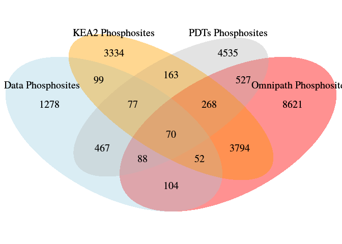
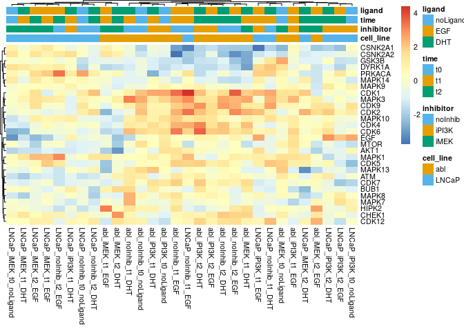
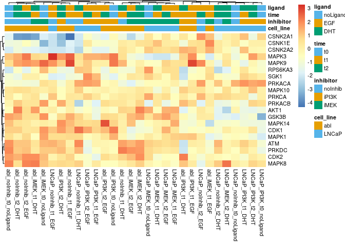
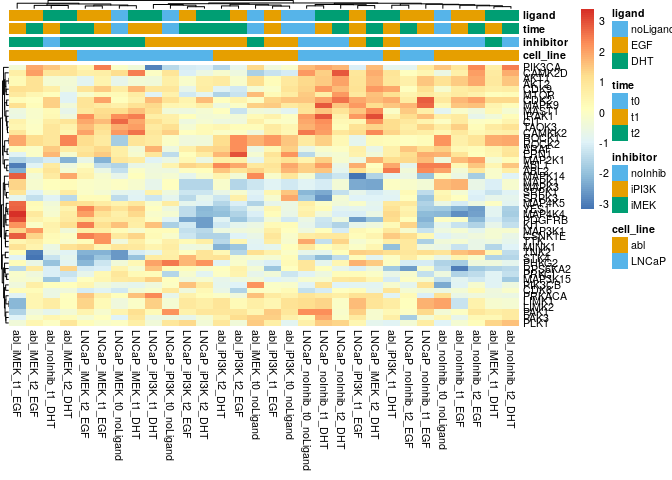
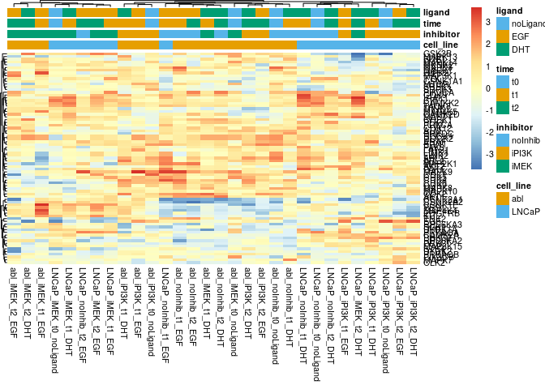

Prostate phosphoSWATH: Kinase Activity Analyses
================
Alberto Valdeolivas: <alberto.valdeolivas@bioquant.uni-heidelberg.de>;
Date:
23/01/2020

## Abstract

Study the phospho-proteome of two prostate cancer cell lines upon
perturbation with a combination of different ligands and inhibitors.
This vignette is focused on the application of Kinase Activity
Estimation Methods.

## Source Overlaps

In this section, we compare the overlap between the phophosites measured
in our study and those already available in **Omnipath**
(<http://omnipathdb.org/>),  
**KEA2** (<https://www.maayanlab.net/KEA2/>) and the Putative Downstream
Targets  
**PDTs** article (<https://www.nature.com/articles/s41587-019-0391-9>).

We first load the required libraries:

``` r
library(readr)
library(dplyr)
library(OmnipathR)
library(VennDiagram)
library(viper)
library(tidyr)
library(pheatmap)
library(gprofiler2)
```

We read here the dataset containing the results of our linear model
performed in the script. We extract the ID of the unique phosphosites to
compare with the prior knowledge resources.

``` r
ResultsLinearModel <- read_tsv("Data/limma_model_results_20190301.tsv")

LinearModelData_df <- ResultsLinearModel %>% 
    dplyr::filter(!is.na(residues_str)) %>% 
    dplyr::mutate(residues_str = strsplit(residues_str, "_")) %>% 
    tidyr::unnest(residues_str) %>% 
    dplyr::mutate(GeneSymbol_Residue = paste(GeneSymbol, residues_str, sep="_")) 

PhophositesData <- LinearModelData_df %>%
    dplyr::pull(GeneSymbol_Residue) %>% 
    unique()
length(PhophositesData)
## [1] 2235
```

We now use the **OmnipathR** package to retrieve from the Omnipath
webserver post-translational modifications. In particular, we select
phosphorylation and dephosphorylation events and get the associated
phosphosites.

``` r
Omnipath_df <- import_Omnipath_PTMS() %>%
    dplyr::filter(modification %in% c("dephosphorylation","phosphorylation")) %>%
    dplyr::mutate(GeneResidue = paste(substrate_genesymbol,(paste0(residue_type,
        residue_offset)), sep = "_")) 

PhophositesOmnipath <- Omnipath_df %>%
    dplyr::pull(GeneResidue)  %>%
    unique()
length(PhophositesOmnipath)
## [1] 13535
```

In order to increase our coverage, we also read the curated list of
phosphosites available in <https://www.maayanlab.net/KEA2>.

``` r
KEA2_database_path <- "Data/kinase-substrate_phospho-site_level_set_library.tsv"

## This dataset contains a totally different format. We created the following
## function to convert their enzyme-substrates interactions to the same format

processFile = function(filepath) {
    kinases <- character()
    substrates <- character()
    con = file(filepath, "r")
  while ( TRUE ) {
    line = readLines(con, n = 1)
    if ( length(line) == 0 ) {
      break
    }
    currentLine <- unlist(strsplit(line,"\t"))
    currentKinase <- currentLine[1] 
    Allsubstrates <- currentLine[3:length(currentLine)]
    
    for (j in seq(Allsubstrates)){
        kinases <- c(kinases, currentKinase)
        substrates <-  c(substrates, Allsubstrates[j])
    }
    
  }
  
  close(con)
  df <- data.frame(kinases = kinases, substrates = substrates, 
    stringsAsFactors = FALSE)
  return(df)
}

KEA2_df <- processFile(KEA2_database_path)

PhosphositesKEA2 <- unique(KEA2_df$substrates)
length(PhosphositesKEA2)
## [1] 7857
```

In addition, we included the putative downstream targets (PDTs) reported
in Hijazi et al (2020)
(<https://www.nature.com/articles/s41587-019-0391-9>)

``` r
## We read the datasets from Hijazi et al 2020. Supplementary Dataset 3
PDTs_df <- 
    read_tsv("Data/41587_2019_391_MOESM5_ESM.csv",col_names = FALSE,  skip = 1) %>%
    dplyr::rename(kinases = "X1", substrates = "X2", kinaseFamily = "X3", sign = "X4") %>%
    dplyr::mutate(substrates = gsub("\\(", "_", substrates)) %>%
    dplyr::mutate(substrates = gsub("\\)", "",substrates)) %>%
    dplyr::select(-kinaseFamily) %>%
    dplyr::distinct()
    
PhophositesPDTs <- PDTs_df %>%
    dplyr::pull(substrates)  %>%
    unique()
length(PhophositesPDTs)
## [1] 6195
```

We now check the overlap in the number of phosphosites between the
different sources:

``` r
## Individual Sources
area1 <- length(PhophositesData)
area2 <- length(PhophositesOmnipath)
area3 <- length(PhosphositesKEA2)
area4 <- length(PhophositesPDTs)

## Pairwise Overlap between Sources
n12 <- length(dplyr::intersect(PhophositesData,PhophositesOmnipath))
n13 <- length(dplyr::intersect(PhophositesData,PhosphositesKEA2))
n14 <- length(dplyr::intersect(PhophositesData,PhophositesPDTs))
n23 <- length(dplyr::intersect(PhophositesOmnipath,PhosphositesKEA2))
n24 <- length(dplyr::intersect(PhophositesOmnipath,PhophositesPDTs))
n34 <- length(dplyr::intersect(PhosphositesKEA2,PhophositesPDTs))

## Triple overlaps
n123 <- length(dplyr::intersect(dplyr::intersect(PhophositesData, 
        PhophositesOmnipath), PhosphositesKEA2))
n124 <- length(dplyr::intersect(dplyr::intersect(PhophositesData, 
        PhophositesOmnipath), PhophositesPDTs))
n134 <- length(dplyr::intersect(dplyr::intersect(PhophositesData, 
        PhosphositesKEA2), PhophositesPDTs))
n234 <- length(dplyr::intersect(dplyr::intersect(PhophositesOmnipath, 
        PhosphositesKEA2), PhophositesPDTs))
    
## Total overlap    
n1234 <- length(dplyr::intersect(dplyr::intersect(dplyr::intersect(PhophositesData, 
        PhophositesOmnipath), PhosphositesKEA2),PhophositesPDTs))
    
Venn_plot <- draw.quad.venn(area1, area2, area3, area4, n12, n13, n14, n23, n24,
    n34, n123, n124, n134, n234, n1234, 
    category = c("Data Phosphosites", "Omnipath Phosphosites",
    "KEA2 Phosphosites", "PDTs Phosphosites"), 
    lty = rep("blank", 4), fill = c("light blue", "red","orange","grey"), 
    alpha = rep(0.25, 4), euler.d = TRUE, scaled=TRUE,
    rotation.degree = 0, reverse=TRUE, cex=1.25,  
    cat.dist = rep(0.075, 4), cat.cex = 1.25)
grid.draw(Venn_plot)
```

<!-- -->

## Kinase Activity Estimation

We are now going to run the Kinase Activity estimation (KAE) using viper
based on the kinase substrate networks (KSN) provided by the different
data sources alone and combined. We want to check out wether the
increase in the phosphosite coverage leads to more interpretable
results.

Next, we define here the general function to generate viper regulons
from KSN:

``` r
#'\code{df_to_viper_regulon}
#'
#'This function is designed to generate a ready to use regulon object for viper
#'from a 3 column dataframe representation of a target set collection.
#'
#'@param df a dataframe of n*3 dimension. The first column corresponds the targets,
#'and the second column indicates which regulon does each target belongs to.
#'The third column corresponds to the weight and sign of the interaction between
#'a regulon and its targets.
#'
#'@return a list where each element is a regulon in the viper format. This list
#'is ready to be used as a regulon set in viper.
df_to_viper_regulon <- function(df)
{
  names(df) <- c("feature","pathway","sign")
  df <- df[complete.cases(df),]
  pathway_regulon <- list(0)
  i <- 1
  for(pathway in unique(df$pathway))
  {
    pathway_feature_list <- list(0)
    features <- df[df$pathway == pathway, 3]
    names(features) <- df[df$pathway == pathway, 1]
    pathway_feature_list[[1]] <- features
    pathway_feature_list[[2]] <- rep(1,length(features))
    names(pathway_feature_list) <- c("tfmode","likelihood")
    pathway_regulon[[i]] <- pathway_feature_list
    i <- i+1
  }
  names(pathway_regulon) <- unique(df$pathway)
  return(pathway_regulon)
}
```

We also transform the results of the linear model intro a matrix with
the proper format to run Viper.

``` r
## create sample annotation for using colors with the heatmaps
non_annotated_vars <- c("Intercept", "LNCaP", "ms_day180409", "ms_day180410", 
    "ms_day180412", "ms_day180414", "Culture_batch", "fraction_missing")
sample_annotation <- ResultsLinearModel %>% 
    select(term) %>% 
    distinct()
sample_annotation <- sample_annotation %>% 
    filter(!(term %in% non_annotated_vars)) %>% 
    separate(term, into=c("cell_line", "inhibitor", "time", "ligand"),
             sep="_", remove=FALSE)
sample_annotation <- sample_annotation %>% 
    mutate_if(is.character, as.factor) %>% 
    as.data.frame()
rownames(sample_annotation) <- sample_annotation$term
sample_annotation <- sample_annotation %>% select(-term)

## Specify colors
ann_colors = list(
  cell_line = c(abl = "#E69F00", LNCaP = "#56B4E9"),
  inhibitor = c(noInhib = "#56B4E9", iPI3K = "#E69F00", iMEK = "#009E73"),
  time = c(t0 = "#56B4E9", t1 = "#E69F00", t2 = "#009E73"),
  ligand = c(noLigand = "#56B4E9", EGF = "#E69F00", DHT = "#009E73")
)

covariate_vars <- c("Intercept","ms_day180409", "ms_day180410", "ms_day180412", 
                    "ms_day180414", "Culture_batch", "fraction_missing", "LNCaP")

## From linear model to Matrix suitable to run Viper.
MatrixStatistic <-     
    LinearModelData_df %>% 
    dplyr::select(statistic,GeneSymbol_Residue, term, p.value) %>%
    dplyr::filter(!(term %in% covariate_vars)) %>%
    dplyr::group_by(GeneSymbol_Residue, term) %>%
    dplyr::filter(p.value == min(p.value)) %>%
    dplyr::ungroup() %>%
    dplyr::distinct() %>% 
    dplyr::select(-p.value)  %>%
    tidyr::pivot_wider(names_from = term, values_from = statistic)  %>%
    tibble::column_to_rownames(var = "GeneSymbol_Residue") %>% 
    as.matrix()
```

### KAE using Omnipath KSN

We generate the KSN only taking into account the information available
in **Omnipath**.

``` r
Omnipath_df_reduced <- Omnipath_df %>%
  dplyr::mutate(sign = ifelse(modification == "phosphorylation",1,-1)) %>%    
  dplyr::select(enzyme_genesymbol,GeneResidue, sign) %>%
  dplyr::rename(kinases = "enzyme_genesymbol", substrates = "GeneResidue")

KSN_Omnipath <- Omnipath_df_reduced %>%
  dplyr::distinct() 
nrow(KSN_Omnipath)
## [1] 33615
```

We generate the regulons and run viper to estimate kinase activity using
the Omnipath KSN and the t-statistic from the limma linear model. We
consider only those kinases regulating at least five phosphosites in our
analysis.

``` r
KSN_Omnipath_regulon <- df_to_viper_regulon(KSN_Omnipath[,c(2,1,3)])

Kin_activity_Omnipath <- viper(MatrixStatistic, regulon = KSN_Omnipath_regulon, 
   minsize = 5, adaptive.size = TRUE, eset.filter = TRUE, verbose = FALSE)
```

We finally display the activity of the kinases for the different
conditions under study:

``` r
pheatmap(Kin_activity_Omnipath, cluster_rows=TRUE, cluster_cols=TRUE,
    annotation_col=sample_annotation, annotation_colors = ann_colors, 
    fontsize=8,  fontsize_row = 8,  treeheight_col = 1.5,  border_color = NA,
    treeheight_row = 1.5)
```

<!-- -->

### KAE using KEA2 KSN

We generate the KSN only taking into account the information available
in **KEA2** (<https://www.maayanlab.net/KEA2/>).

``` r
KSN_KEA2 <- KEA2_df %>%
  dplyr::distinct() %>%
  dplyr::mutate(sign = 1)
nrow(KSN_KEA2)
## [1] 13889
```

We generate the regulons and run viper to estimate kinase activity using
the KEA2 KSN and the t-statistic from the limma linear model. We
consider only those kinases regulating at least five phosphosites in our
analysis.

``` r
KSN_KEA2_regulon <- df_to_viper_regulon(KSN_KEA2[,c(2,1,3)])

Kin_activity_KEA2 <- viper(MatrixStatistic, regulon = KSN_KEA2_regulon, 
   minsize = 5, adaptive.size = TRUE, eset.filter = TRUE, verbose = FALSE)
```

We finally display the activity of the kinases for the different
conditions under study:

``` r
pheatmap(Kin_activity_KEA2, cluster_rows=TRUE, cluster_cols=TRUE,
    annotation_col=sample_annotation, annotation_colors = ann_colors, 
    fontsize=8,  fontsize_row = 8,  treeheight_col = 1.5,  border_color = NA,
    treeheight_row = 1.5)
```

<!-- -->

### KAE using PDTs KSN

We generate the KSN only taking into account the information reported in
the **PDTs** study (Hijazi et al. 2020).

``` r
KSN_PDTs <- as.data.frame(PDTs_df)
nrow(KSN_PDTs)
## [1] 19326
```

We generate the regulons and run viper to estimate kinase activity using
the PDTs KSN and the t-statistic from the limma linear model. We
consider only those kinases regulating at least five phosphosites in our
analysis.

``` r
KSN_PDTs_regulon <- df_to_viper_regulon(KSN_PDTs[,c(2,1,3)])

Kin_activity_PDTs <- viper(MatrixStatistic, regulon = KSN_PDTs_regulon, 
   minsize = 5, adaptive.size = TRUE, eset.filter = TRUE, verbose = FALSE)
saveRDS(Kin_activity_PDTs, file = "Results/Kin_activity_PDTs.rds")
```

We finally display the activity of the kinases for the different
conditions under study:

``` r
pheatmap(Kin_activity_PDTs, cluster_rows=TRUE, cluster_cols=TRUE,
    annotation_col=sample_annotation, annotation_colors = ann_colors, 
    fontsize=8,  fontsize_row = 8,  treeheight_col = 1.5,  border_color = NA,
    treeheight_row = 1.5)
```

<!-- -->

### KAE merging all the resources to build KSN

We finally merge all the resources (**Omnipath** + **KEA2** + **PDTs**)
to generate a new Kinase regulatory network and we run Viper again.
Note: If finally use this information, we have to take into account
(discuss) that PDTs also include inderect interactions (downstream
estimations).

``` r
KSN_merged_Allsources <- dplyr::bind_rows(KSN_Omnipath, KSN_KEA2, KSN_PDTs) %>%
  dplyr::distinct() %>%
  dplyr::mutate(sign = 1)
nrow(KSN_merged_Allsources)
## [1] 60716
```

We generate the regulons and run viper to estimate kinase activity using
all the sources to build a KSN and the t-statistic from the limma linear
model. We consider only those kinases regulating at least five
phosphosites in our analysis.

``` r
KSN_Allsources_regulon <- df_to_viper_regulon(KSN_merged_Allsources[,c(2,1,3)])

Kin_activity_Allsources <- viper(MatrixStatistic, regulon = KSN_Allsources_regulon, 
   minsize = 5, adaptive.size = TRUE, eset.filter = TRUE, verbose = FALSE)
```

We finally display the activity of the kinases for the different
conditions under study:

``` r
pheatmap(Kin_activity_Allsources, cluster_rows=TRUE, cluster_cols=TRUE,
    annotation_col=sample_annotation, annotation_colors = ann_colors, 
    fontsize=8,  fontsize_row = 8,  treeheight_col = 1.5,  border_color = NA,
    treeheight_row = 1.5)
```

<!-- -->

## Conclusions

A pfd version of the heatmap figures can be found at
<https://github.com/saezlab/prostate-phosphoSWATH_V2/tree/master/FiguresKAE>.
Looking at these heatmaps, we decided to focus on the KAE results using
the PDTs data to build the KSN. The two different cell lines cluster in
a “quite” well separation, excepting for the PI3K inhibition and the EGF
ligand. We focus here in the analysis of some cluster of kinases that
are active/ under certain conditions:

### ABL1, ABL2, LIMK1, LIMK2 and MINK1 (TNK2?)

I focus in this because they do not have a clear activity profile, but
they are very active in this condition.

These kinases are specifically very active in the non-inhibited LNCaP
cell line during the second time point after treatment with EGF.

We first performed an enrichment analyses. We use Kinases from PDTs
network as a background (very stringent test).

``` r
## To fair a very restringent enrichment, we just consider kinases in the KSN 
GeneSet <-  c("MINK1","ABL1","ABL2","LIMK1","LIMK2")
KinaseBackground <- unique(KSN_PDTs$kinases)
EnrichmentResults <- gost(GeneSet, significant = TRUE, user_threshold = 0.05, 
    organism = 'hsapiens',custom_bg=KinaseBackground,
    correction_method = c("fdr"))[[1]] %>%
    dplyr::filter(intersection_size >= 2) %>%
    dplyr::select(term_id, source, term_name, p_value) %>%
    dplyr::arrange(p_value)
EnrichmentResults
##      term_id source                       term_name    p_value
## 1 GO:0030029  GO:BP    actin filament-based process 0.04052825
## 2 GO:0030036  GO:BP actin cytoskeleton organization 0.04052825
## 3 GO:0003779  GO:MF                   actin binding 0.04605427
## 4 GO:0003785  GO:MF           actin monomer binding 0.04605427
## 5 GO:0051015  GO:MF          actin filament binding 0.04605427
```

Then, we carefully reviewed the literature:

**Regarding LIMK1 & LIMK2**

LIMK1 and LIMK2 are serine/threonine kinases with a major function in
the regulation of actin filament dynamics. LIMK1 is activated by
upstream kinases such a ROCK1, PAK1 and PAK4, which phosphorylate LIMK1
(Maekawa et al. 1999). This proteins are also clustering together in our
KAE analyses.

It has been reported that the ROCK/LIMK/cofilin signaling pathway plays
important roles in carcinogenic processes such as proliferation,
survival, migration, and invasion of tumor cells. Growth factors
including transforming growth factor (TGF)-β can activate
guanine-nucleotide exchange factors (GEFs) and Rho GTPases by binding to
receptor tyrosine kinases and relay signals to down-stream targets LIMKs
and cofilins by phosphorylation, thereby inducing actin cytoskeleton
reorganization, actin dynamics of nuclear or cytoplasm, and gene
transcription (Philimonenko et al. 2004; Kapoor and Shen 2014; Chang et
al. 2015). Therefore, the ROCK-LIMK/cofilin signaling cascade can cause
or promote proliferation and motility of cancer cells as a result of
actin remodeling (Extracted from Lee et al. 2019). For instance, it has
been shown that imbalanced LIMK1 and LIMK2 expression leads to human
colorectal cancer progression and metastasis via promoting β-catenin
nuclear translocation via promoting β-catenin nuclear translocation
(Zhang et al. 2018).

LIMK1 signaling indeed plays a pivotal role in the regulation of EGFR
trafficking through the endocytic pathway in invasive tumor cells. We
previously reported that the overexpression of LIMK1 in less invasive
cell lines, MCF-7, resulted in a marked retardation of the
internalization of the receptor-mediated endocytic tracer, Texas
red-labeled EGF, and that internalized EGF was accumulated in
transferrin receptor-positive early endosomes instead of being
transported to late endosomes (Nishimura et al. 2004). We therefore
postulate that LIMK1 signaling pathway plays a key role in the
regulation of ligand-induced EGFR vesicle traffic through the endocytic
pathway in invasive tumor cells by reorganizing and influencing
actin-filament dynamics. Although the outline of the endocytic pathway
appears to be established, the molecular mechanisms underlying the
sorting and trafficking events in endosomes are still remains to be
seen. The identification and characterization of each regulatory
component in the endocytic pathway are of importance for the further
clarification of its machinery. In the present study, we have further
assessed the possible role of LIMK1 in the endocytic pathway of
ligand-induced EGFR by employing a kinase-deficient dominant negative
form of LIMK1 (DN-LIMK1) or an active, unphosphorylatable form of S3A
cofilin mutant in MDA-MB-231, a highly invasive human breast cancer cell
line. Here, we provide evidence that EGF-EGFR traffic out of early
endosomes is impaired by the expression of LIMK1, whereas the
transfection of kinase-deficient LIMK1 mutant or S3A cofilin mutant
rescues the efficient endocytosis of ligand-induced EGFR in MDA-MB-231
cells. Thereby, we propose that kinase activity of LIMK1 may coordinate
vesicular traffic of EGFR out of early endosomes (Extracted from
Nishimura et al. 2006).

*Can this raterded response explain the high activity of these kinases
on t2 compare to t1?*

\*\* Regarding ABL1/ABL2\*\* The Abl family kinases, Abl1 (c-Abl) and
Abl2 (Arg), play a role in the regulation of cytoskeletal
reorganization, cell migration, proliferation, and survival (17). We and
others have shown that endogenous Abl kinases are rapidly activated
after EGFR stimulation (18-20). Abl kinases are required for
EGF-mediated membrane ruffling and Rac activation at physiological
concentrations of the ligand (21). Moreover, the SH2 domains of Abl1 and
Abl2 have been shown to bind with high affinity to the EGFR and other
ErbB family members by interacting with multiple tyrosines on the
phosphorylated receptors (19, 22). However, little is known regarding
the effects of Abl activation on EGFR physiological functions. Similar
to the EGFR, Abl kinase hyperactivation has been linked to the
pathogenesis of cancer. Chromosomal translocation events in human
leukemias give rise to structurally altered oncogenic Abl fusion
proteins such as Bcr-Abl, Tel-Abl, and Tel-Arg (17). Furthermore,
enhanced expression of Abl kinases is observed in a subset of primary
colon carcinomas and metastatic tumors (23), as well as in pancreatic
ductal carcinomas and renal medullary carcinoma (24, 25). Also, Abl
kinases are constitutively activated downstream of ErbB receptors and
Src kinases in breast cancer cell lines (20). Here we show that the
activated Abl kinase phosphorylates the EGFR at specific sites and
uncouples the receptor from ligand-mediated
internalization.Additionally, we show that kinase-active Abl disrupts
the Cbl recruitment to the activated EGFR. *Thus, Abl and the EGFR may
function synergistically in the pathogenesis of human tumors.*
(Extracted from Tanos et al 2006).

**Regarding MINK1**

Daulat et al. show that the adaptor PRICKLE1 interacts with RICTOR and
positively controls mTORC2 signaling and cancer cell migration. The
PRICKLE1-RICTOR interaction is enhanced by MINK1, a prometastatic
serine/threonine kinase. They also show that upregulation of PRICKLE1 is
associated with AKT signaling and poor prognosis in basal breast cancers
(Extracted from Daulat et al. 2016)

**Regarding TNK2**

Interestingly, TNK2 – a downstream effector of Cdc42 – can also be
activated in response to EGF and interacts with EGFR via a previously
characterised EGFR binding domain \[16\]. It has also been reported,
however, that TNK2 regulates clathrin-mediated EGFR endocytosis and
facilitates receptor degradation \[17–19\]. While Cdc42 maintains EGFR
on the cell surface, therefore, TNK2 in contrast has paradoxically been
reported to facilitate degradation, which is at odds with its potential
role as an oncogene \[15, 20\]. Importantly, no functional effects of
the TNK2/EGFR interaction have been established in a cancer context to
date – and, more importantly, it is not known how aberrant expression of
EGFRs often found in cancer cells affects this protein–protein
interaction (Extracted from Howlin et al 2008)

### PAK3, PAK1, PRKACA, ROCK1, ROCK2 (active in abl iMEK no ligand. t0. Unactive in LNCaP?)

### MAST1, CIT, IRAK1, TAOK3, CAMKK2 (active in abl no inh t1 DHT, active in abl i3PiK t1 DHT. Not active in abl no Inh t2 DHT. Also interestingly, not active in abl IMEK t1 DHT. To explore)

### CAMDK2D, SRPK3, CDK9, CDK2. (active in LNCaP IMEK t1 DHT)

### MAP4K5, MAP3K1, CSNK1E, YES1 and MAP4K4 (Driving the global cluster??)

## References

D Turei, T Korcsmaros and J Saez-Rodriguez (2016) OmniPath: guidelines
and gateway for literature-curated signaling pathway resources. Nature
Methods 13 (12) PMID: 27898060

Hijazi, M., Smith, R., Rajeeve, V. et al. Reconstructing kinase network
topologies from phosphoproteomics data reveals cancer-associated
rewiring. Nat Biotechnol (2020).
<https://doi.org/10.1038/s41587-019-0391-9>

Midori Maekawa, Toshimasa Ishizaki, Shuken Boku, et al. (1999).
Signaling from Rho to the Actin Cytoskeleton Through Protein Kinases
ROCK and LIM-kinase. SCIENCE06 AUG 1999 : 895-898

Lee, M., Kundu, J.K., Chae, J. et al. Targeting ROCK/LIMK/cofilin
signaling pathway in cancer. Arch. Pharm. Res. 42, 481–491 (2019).
<https://doi.org/10.1007/s12272-019-01153-w>

Zhang, Y., Li, A., Shi, J. et al. Imbalanced LIMK1 and LIMK2 expression
leads to human colorectal cancer progression and metastasis via
promoting β-catenin nuclear translocation. Cell Death Dis 9, 749 (2018).
<https://doi.org/10.1038/s41419-018-0766-8>

Nishimura, Y., Yoshioka, K., Bernard, O. et al. A role of LIM kinase
1/cofilin pathway in regulating endocytic trafficking of EGF receptor in
human breast cancer cells. Histochem Cell Biol 126, 627 (2006).
<https://doi.org/10.1007/s00418-006-0198-x>

Barbara Tanos and Ann Marie Pendergast. Abl Tyrosine Kinase Regulates
Endocytosis of the Epidermal Growth Factor Receptor. J. Biol. Chem. 2006
281: 32714-. <doi:10.1074/jbc.M603126200>

Avais M.Daulat, François Bertucci Stéphane Audebert et al. PRICKLE1
Contributes to Cancer Cell Dissemination through Its Interaction with
mTORC2. Developmental Cell Volume 37, Issue 4, 23 May 2016, Pages
311-325. <https://doi.org/10.1016/j.devcel.2016.04.011>

Howlin, J., Rosenkvist, J. & Andersson, T. TNK2 preserves epidermal
growth factor receptor expression on the cell surface and enhances
migration and invasion of human breast cancer cells. Breast Cancer Res
10, R36 (2008). <https://doi.org/10.1186/bcr2087>
