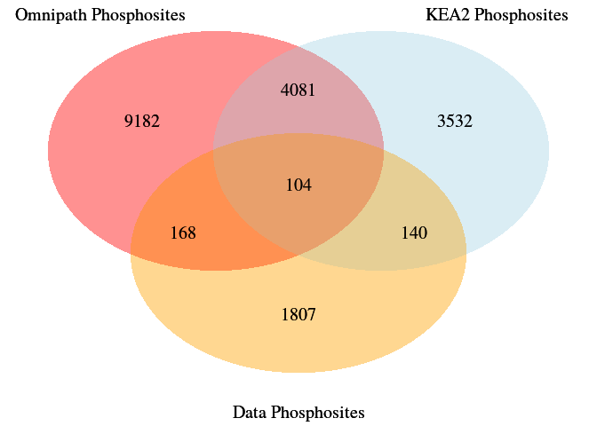
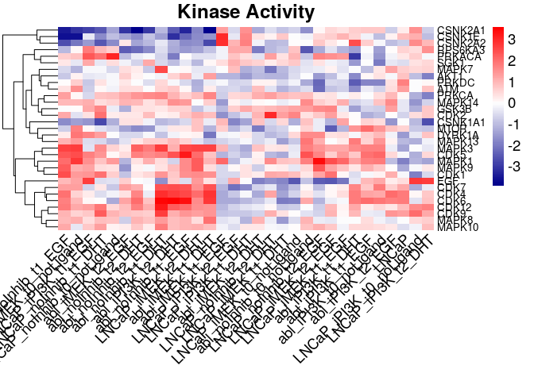

Prostate phosphoSWATH: Kinase Activity Analyses
================
Alberto Valdeolivas: <alberto.valdeolivas@bioquant.uni-heidelberg.de>;
Date:
23/01/2020

## Abstract

Study the phospho-proteome of two prostate cancer cell lines upon
perturbation with a combination of different ligands and inhibitors.
This vignette is focused on the application of Kinase Activity
Estimation Methods.

## Source Overlaps

In this section, we compare the overlap between the phophosites measured
in our study and those already available in **Omnipath**
(<http://omnipathdb.org/>) and **KEA2**
(<https://www.maayanlab.net/KEA2/>).

We first load the required libraries:

``` r
library(readr)
library(dplyr)
library(OmnipathR)
library(VennDiagram)
library(viper)
library(tidyr)
library(pheatmap)
```

We read here the dataset containing the results of our linear model
performed in the script….*(To discuss with Luis)*. We extract the ID of
the unique phosphosites to compare with the prior knowledge resources.

``` r
ResultsLinearModel <- read_tsv("Data/limma_model_results_20180911.tsv")

PhophositesData <- ResultsLinearModel %>% 
    dplyr::filter(!is.na(GeneSymbol)) %>% 
    dplyr::filter(!is.na(residues_str)) %>% 
    dplyr::mutate(GeneSymbol_Residue =paste(GeneSymbol,residues_str,sep = "_")) %>%
    dplyr::pull(GeneSymbol_Residue) %>% 
    unique()
length(PhophositesData)
## [1] 2219
```

We now use the **OmnipathR** package to retrieve from the Omnipath
webserver post-translational modifications. In particular, we select
phosphorylation and dephosphorylation events and get the associated
phosphosites.

``` r
Omnipath_df <- import_Omnipath_PTMS() %>%
    dplyr::filter(modification %in% c("dephosphorylation","phosphorylation")) %>%
    dplyr::mutate(GeneResidue = paste(substrate_genesymbol,(paste0(residue_type,
        residue_offset)), sep = "_")) 

PhophositesOmnipath <- Omnipath_df %>%
    dplyr::pull(GeneResidue)  %>%
    unique()
length(PhophositesOmnipath)
## [1] 13535
```

In order to increase our coverage, we also read the curated list of
phosphosites available in <https://www.maayanlab.net/KEA2>.

``` r
KEA2_database_path <- "Data/kinase-substrate_phospho-site_level_set_library.tsv"

## This dataset contains a totally different format. We created the following
## function to convert their enzyme-substrates interactions to the same format

processFile = function(filepath) {
    kinases <- character()
    substrates <- character()
    con = file(filepath, "r")
  while ( TRUE ) {
    line = readLines(con, n = 1)
    if ( length(line) == 0 ) {
      break
    }
    currentLine <- unlist(strsplit(line,"\t"))
    currentKinase <- currentLine[1] 
    Allsubstrates <- currentLine[3:length(currentLine)]
    
    for (j in seq(Allsubstrates)){
        kinases <- c(kinases, currentKinase)
        substrates <-  c(substrates, Allsubstrates[j])
    }
    
  }
  
  close(con)
  df <- data.frame(kinases = kinases, substrates = substrates, 
    stringsAsFactors = FALSE)
  return(df)
}

KEA2_df <- processFile(KEA2_database_path)

PhosphositesKEA2 <- unique(KEA2_df$substrates)
length(PhosphositesKEA2)
## [1] 7857
```

We now check the overlap in the number of phosphosites between the
different sources:

``` r
Venn_plot <- draw.triple.venn(length(PhosphositesKEA2), 
    length(PhophositesOmnipath), 
    length(PhophositesData), 
    n12 = length(dplyr::intersect(PhosphositesKEA2,PhophositesOmnipath)), 
    n23 = length(dplyr::intersect(PhophositesOmnipath, 
        PhophositesData)),
    n13 = length(dplyr::intersect(PhosphositesKEA2, PhophositesData)), 
    n123 = length(dplyr::intersect(dplyr::intersect(PhosphositesKEA2, 
        PhophositesOmnipath), 
        PhophositesData)),
    category = c("KEA2 Phosphosites", "Omnipath Phosphosites",
        "Data Phosphosites"), 
    lty = rep("blank", 3), fill = c("light blue", "red","orange"), 
    alpha = rep(0.25, 3), euler.d = TRUE, scaled=TRUE,
    rotation.degree = 0, reverse=TRUE, cex=1.25, cat.pos = c(330, 30 , 180), 
    cat.dist = rep(0.075, 3), cat.cex = 1.25)
grid.draw(Venn_plot)
```

<!-- -->

## Kinase Activity Estimation

We combine the phosphorylation interactions from KEA2 and Omnipath and
use them to generate a Kinase substrate network. This network is used to
estimate kinase activity in the different conditions under study.

``` r
Omnipath_df_reduced <- Omnipath_df %>%
  dplyr::select(enzyme_genesymbol,GeneResidue) %>%
  dplyr::rename(kinases = "enzyme_genesymbol", substrates = "GeneResidue")

KSN_merged <- dplyr::bind_rows(Omnipath_df_reduced, KEA2_df) %>%
  dplyr::distinct() %>%
  dplyr::mutate(sign = 1)
nrow(KSN_merged)
## [1] 40801
```

Next, we define the function to generate viper regulons from the
previous Kinase substrate network.

``` r
#'\code{df_to_viper_regulon}
#'
#'This function is designed to generate a ready to use regulon object for viper
#'from a 3 column dataframe representation of a target set collection.
#'
#'@param df a dataframe of n*3 dimension. The first column corresponds the targets,
#'and the second column indicates which regulon does each target belongs to.
#'The third column corresponds to the weight and sign of the interaction between
#'a regulon and its targets.
#'
#'@return a list where each element is a regulon in the viper format. This list
#'is ready to be used as a regulon set in viper.
df_to_viper_regulon <- function(df)
{
  names(df) <- c("feature","pathway","sign")
  df <- df[complete.cases(df),]
  pathway_regulon <- list(0)
  i <- 1
  for(pathway in unique(df$pathway))
  {
    pathway_feature_list <- list(0)
    features <- df[df$pathway == pathway, 3]
    names(features) <- df[df$pathway == pathway, 1]
    pathway_feature_list[[1]] <- features
    pathway_feature_list[[2]] <- rep(1,length(features))
    names(pathway_feature_list) <- c("tfmode","likelihood")
    pathway_regulon[[i]] <- pathway_feature_list
    i <- i+1
  }
  names(pathway_regulon) <- unique(df$pathway)
  return(pathway_regulon)
}

KSN_viper <- df_to_viper_regulon(KSN_merged[,c(2,1,3)])
```

We run viper to estimate kinase activity using the Kinase Regulatory
network and the t-statistic from the limma linear model. We consider
only those kinases regulating at least five phosphosites in our
analysis.

``` r
## We transform the results of the linear model into a matrix with the proper 
## format for the input to viper
MatrixStatistic <-     
    ResultsLinearModel %>% 
    dplyr::filter(!is.na(GeneSymbol)) %>% 
    dplyr::filter(!is.na(residues_str)) %>% 
    dplyr::filter(!(term %in% c("Phospho_batch3","Phospho_batch2",
        "Culture_batch","Culture_order","fraction_missing",
        "fraction_missing","Intercept"))) %>%
    dplyr::mutate(GeneSymbol_Residue =paste(GeneSymbol,residues_str, 
        sep = "_")) %>% 
    dplyr::select(statistic,GeneSymbol_Residue, term) %>%
    dplyr::group_by(GeneSymbol_Residue, term) %>%
    dplyr::mutate(statistic = mean(statistic)) %>%
    dplyr::ungroup() %>%
    dplyr::distinct()  %>%
    tidyr::pivot_wider(names_from = term, values_from = statistic)  %>%
    tibble::column_to_rownames(var = "GeneSymbol_Residue") %>%
    as.matrix()
  

Kin_activity <- t(viper(MatrixStatistic, regulon = KSN_viper, 
   minsize = 5, adaptive.size = TRUE, eset.filter = TRUE))
```

We finally display the results in a heatmap. For a better visualization,
a png and pdf file of this heatmap can be found here:
<https://github.com/saezlab/prostate-phosphoSWATH_V2/blob/master/KisaneActivityHeatMap.pdf>

and

<https://github.com/saezlab/prostate-phosphoSWATH_V2/blob/master/KisaneActivityHeatMap.png>,

``` r
paletteLength = 100
myColor = colorRampPalette(c("Darkblue", "white","red"))(paletteLength)
viperBreaks <- c(seq(min(Kin_activity), 0, 
                     length.out=ceiling(paletteLength/2) + 1),
                 seq(max(Kin_activity)/paletteLength, 
                     max(Kin_activity), 
                     length.out=floor(paletteLength/2)))
viper_hmap <- pheatmap(t(Kin_activity),fontsize=14, 
                       fontsize_row = 10, 
                       color=myColor, breaks = viperBreaks, 
                       main = "Kinase Activity", angle_col = 45,
                       treeheight_col = 0,  border_color = NA) 
```

<!-- -->

## References

D Turei, T Korcsmaros and J Saez-Rodriguez (2016) OmniPath: guidelines
and gateway for literature-curated signaling pathway resources. Nature
Methods 13 (12) PMID: 27898060
