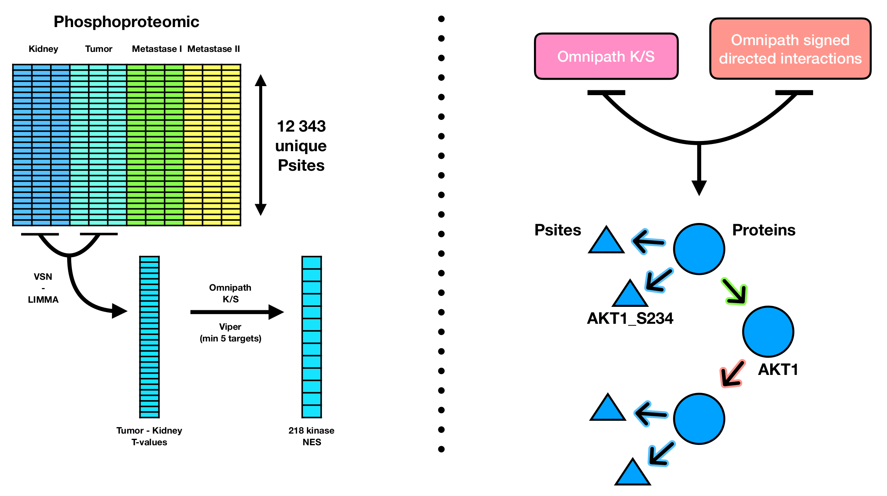

Prostate phosphoSWATH: CARNIPHAL
================
Alberto Valdeolivas: <alberto.valdeolivas@bioquant.uni-heidelberg.de>;
Date:
11/02/2020

## Abstract

Study the phospho-proteome of two prostate cancer cell lines upon
perturbation with a combination of different ligands and inhibitors.
This vignette is focused on the application of CARNIVAL using as input
results of the limma model and the Kinase activity estimation (see
Vignette:
<https://github.com/saezlab/prostate-phosphoSWATH_V2/blob/master/KinaseActivityAnalyses.md>).

## CARNIPHAL (CARNIVAL using Phosphosites and Kinases)

In this vignette, we run CARNIVAL (Liu et al. 2019) but using a
particular set of inputs:

  - Our *prior knowledge network* contains both: Omnipath signed
    directed interactions and a kinsae-substrate interactions describing
    phosphorilation events.

  - Our *measurements file* contains the phosphosites with the most
    significant t-values from the linear model

  - Our *weights file* contains the kinase activity estimation (i.e NES
    scores derived from viper) .

  - Our *perturbation file* contains the known experimental conditions
    about activations with ligands or inhibitions.

The method is illustrated in the figure below (by Aurelien Dugourd).

<br><br>  <br><br>

### Reading and formatting CARNIPHAL inputs

We first load the required libraries. In addition, we define a function
to scale the values of the KAE between -1 and +1 .

``` r
library(CARNIVAL)
library(OmnipathR)
library(dplyr)
library(readr)
library(bc3net)

range <- function(x){ (x - min(x))/(max(x)-min(x)) * (1 - (-1)) + -1 }
```

### Generating the prior knowledge Network

We are going to generate a network containing both PPI interactions and
PTMs accounting for phosphorylation events. The PPI is obtained from the
Omnipath database (Turei et al. 2016). As we showed in the KAE vignette,
there is a very reduced overlap between known phosphistes and the ones
detected in our experiment. To increase the coverage, we took the
putative downstream targets (PDTs) from the Hijazi study (Hijazi et
al. 2020). This would be our prior knowledge network to use in
CARNIVAL.

``` r
OmnipathInteractions <- import_Omnipath_Interactions() %>%
    dplyr::filter(consensus_stimulation != 0 | consensus_inhibition != 0)  %>%  
    dplyr::mutate(sign = if_else(consensus_stimulation==1,1,-1)) %>%
    dplyr::select(source_genesymbol, sign,  target_genesymbol) %>%
    dplyr::rename(source ="source_genesymbol", target ="target_genesymbol") 
    
PDTs_df <- 
    read_tsv("Data/41587_2019_391_MOESM5_ESM.csv",col_names = FALSE,  skip = 1) %>%
    dplyr::rename(kinases = "X1", substrates = "X2", kinaseFamily = "X3", sign = "X4") %>%
    dplyr::mutate(substrates = gsub("\\(", "_", substrates)) %>%
    dplyr::mutate(substrates = gsub("\\)", "",substrates)) %>%
    dplyr::select(-kinaseFamily) %>%
    dplyr::distinct()  

KSN_PDTs <- as.data.frame(PDTs_df) %>%
    dplyr::rename(source="kinases", target="substrates") %>%
    dplyr::select(source, sign, target)

CarnivalNetwork <- dplyr::bind_rows(OmnipathInteractions, KSN_PDTs) %>%
    dplyr::distinct()

## We remove some characters that CPLEX cannot deal with. 
CarnivalNetwork$target <- gsub("[/]","_",CarnivalNetwork$target)
CarnivalNetwork$target <- gsub("[space]","_",CarnivalNetwork$target)
CarnivalNetwork$source <- gsub("[-]", "_", CarnivalNetwork$source)
CarnivalNetwork$target <- gsub("[-]", "_", CarnivalNetwork$target)
CarnivalNetwork$source <- gsub(pattern = "/", replacement = "_", 
    x = CarnivalNetwork$source, fixed = TRUE)
CarnivalNetwork$source <- gsub(pattern = " ", replacement = "_", 
    x = CarnivalNetwork$source, fixed = TRUE)
CarnivalNetwork$target <- gsub(pattern = "/", replacement = "_", 
    x = CarnivalNetwork$target, fixed = TRUE)
CarnivalNetwork$target <- gsub(pattern = " ", replacement = "_", 
    x = CarnivalNetwork$target, fixed = TRUE)
```

We keep only the largest connected component of our network.

``` r
CarnivalNetwork_igraph <- 
    graph_from_data_frame(CarnivalNetwork[,c(1,3)], directed = TRUE) %>% 
    getgcc() %>%
    igraph::as_data_frame()  

CarnivalNetwork_gcc <- dplyr::semi_join(CarnivalNetwork,CarnivalNetwork_igraph,
    by = c("source" = "from", "target" = "to")) %>% 
    dplyr::distinct()
```

### Reading and Formatting linear model results

We read the linear model and we take the t-values of the significant
phosphosites for our condition of interest. In this case, we are going
to focus on the LNCaP cell line with no inhibition and after stimulation
by EGF ligand in the first time point (t1). It was described as an
interesting situation based on the KAE results presented in the previous
vignette.

We will use these t-values of the phosphosites as the dowstream targets
for CARNIVAL input (in analogy to the TFs in the original CARNIVAL
publication).

``` r
ResultsLinearModel <- read_tsv("Data/limma_model_results_20190301.tsv")

LinearModelData_df <- ResultsLinearModel %>% 
    dplyr::filter(!is.na(residues_str)) %>% 
    dplyr::mutate(residues_str = strsplit(residues_str, "_")) %>% 
    tidyr::unnest(residues_str) %>% 
    dplyr::mutate(GeneSymbol_Residue = paste(GeneSymbol, residues_str, sep="_")) 

LinearModelData_LNCaP_noInhib_t1_EGF <- LinearModelData_df %>%
    dplyr::filter(term == "LNCaP_noInhib_t1_EGF") %>%
    dplyr::filter(p.value < 0.05)  %>%
    dplyr::select(GeneSymbol_Residue, statistic, p.value)  %>% 
    dplyr::group_by(GeneSymbol_Residue) %>%
    dplyr::filter(p.value == min(p.value))  %>%
    dplyr::ungroup() %>%
    dplyr::distinct() %>%
    dplyr::select(-p.value)  %>%
    dplyr::filter(GeneSymbol_Residue %in% CarnivalNetwork_gcc$target) %>%
    tibble::column_to_rownames(var = "GeneSymbol_Residue") %>%
    as.data.frame() 
```

### Reading and Formatting NES scores (KAE results)

We also read the Kinase activity results (NES scores from VIPER) for our
condition of interest. CARNIVAL maps these scores into their respective
kinase nodes in our prior knowledge network. Then, CARNIVAL explores the
different possible paths based in these weights, and outputs a network
taking into account the most active kinases. These weights are used in
analogy to the pathawys scores from PROGENy in the original CARNIVAL
publication.

``` r
Kin_activity_PDTs <- as.data.frame(readRDS("Results/Kin_activity_PDTs.rds")) 

Kin_activity_LNCaP_noInhib_t1_EGF <- Kin_activity_PDTs  %>%
    dplyr::select(LNCaP_noInhib_t1_EGF) 

## We have to scale the NES between 1 and 0. 
Kin_activity_LNCaP_noInhib_t1_EGF$LNCaP_noInhib_t1_EGF <- 
    as.data.frame(range(Kin_activity_LNCaP_noInhib_t1_EGF$LNCaP_noInhib_t1_EGF))
```

### Perturbation: Activiatory or inhibitory conditions

In our condition under study, the ligand EGF is used on the cell lines.
We can introduce this condition into CARNIVAL as the input of an
activatory perturbation.

``` r
inputObj <- data.frame(EGF = 1)
```

## Running CARNIPHAL

We finally run CARNIPHAL for our particular condition of interest and we
aforementioned inputs:

``` r
CarnivalResults <-runCARNIVAL(
    solverPath="/opt/ibm/ILOG/CPLEX_Studio129/cplex/bin/x86-64_linux/cplex",
    netObj=CarnivalNetwork_gcc,
    measObj=as.data.frame(t(LinearModelData_LNCaP_noInhib_t1_EGF)),
    inputObj = inputObj,
    DOTfig=TRUE, 
    dir_name="Results",
    weightObj=as.data.frame(t(Kin_activity_LNCaP_noInhib_t1_EGF)),
    # nodeID = 'gene',
    timelimit = 14400,
    solver = "cplex")
saveRDS(CarnivalResults, file = "Results/CarnivalResults.rds")
```

## Interpreting the results

The results can be found in the following reference in our github
repository:
<https://github.com/saezlab/prostate-phosphoSWATH_V2/blob/master/Results/ActivityNetwork_model_Nr0_Uniprot.eps>
<https://github.com/saezlab/prostate-phosphoSWATH_V2/blob/master/Results/ActivityNetwork_model_Nr0_Uniprot.dot>

I maybe should change the results since they are a bit misleading
compare to the Kinase activity results. For the CARNIVAL output, blue
means active wheres it is the other way around for the Kinase activity
heatmaps.

In the Carniphal output, it seems interesting the role played by PRKCA.
The application of EGF seems to activate PRKCA which, in turn activates
some of the proteins in the MAPK pathway. To provide some example, one
of the cascades ends up in LIMK1 which phosphorylates many sites and it
is implicated in actin filament dynamics and stabilizing the actin
cytoskeleton. In this way, LIMK1 regulates several actin-dependent
biological processes including cell motility, cell cycle progression,
and differentiation. LIMK1 is overexpressed in highly aggressive and
metastatic prostate cancers (Davila et al 2007). LNCaP cells are not
highly metastatic/aggresive and the perturbation with EGF ligand can
lead to the increase in their metastic activity throught these
signalling cascades.

In addition, PRKCA inhibits MET which in turns leads to the low activity
of some of the kinases reported in the KAE (KIT, MAPK14, MAP4K5).

## References

D Turei, T Korcsmaros and J Saez-Rodriguez (2016) OmniPath: guidelines
and gateway for literature-curated signaling pathway resources. Nature
Methods 13 (12) PMID: 27898060

Hijazi, M., Smith, R., Rajeeve, V. et al. Reconstructing kinase network
topologies from phosphoproteomics data reveals cancer-associated
rewiring. Nat Biotechnol (2020).
<https://doi.org/10.1038/s41587-019-0391-9>

Liu A, Trairatphisan P, Gjerga E, Didangelos A, Barratt J,
Saez-Rodriguez J. (2019). From expression footprints to causal pathways:
contextualizing large signaling networks with CARNIVAL. npj Systems
Biology and Applications, <https://doi.org/10.1038/s41540-019-0118-z>.

Davila, M., Jhala, D., Ghosh, D. et al. Expression of LIM kinase 1 is
associated with reversible G1/S phase arrest, chromosomal instability
and prostate cancer. Mol Cancer 6, 40 (2007).
<https://doi.org/10.1186/1476-4598-6-40>
